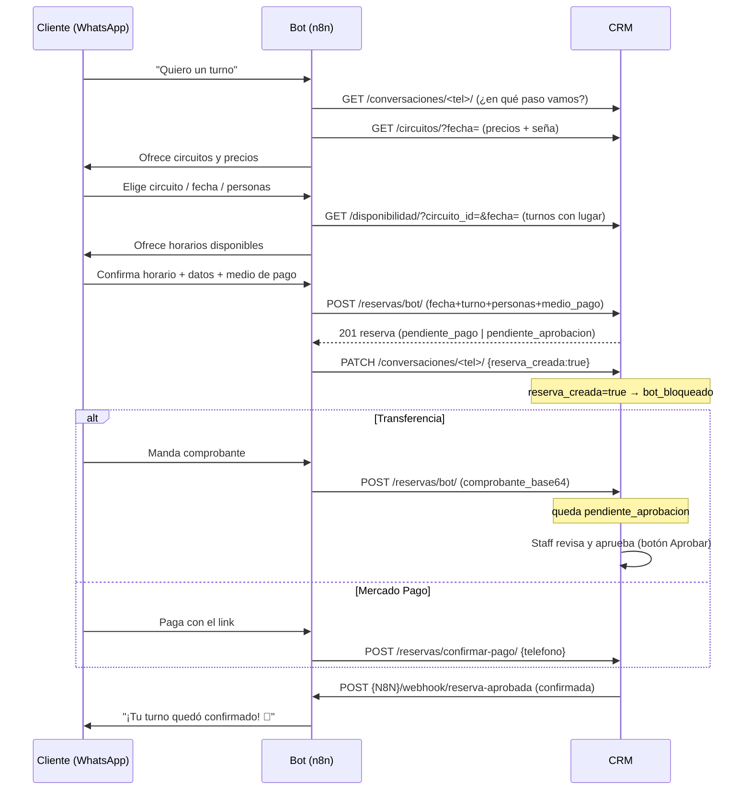

# Flujo del bot ↔ CRM para gestionar turnos

Documento para coordinar con quien arma el flujo de **n8n**. Describe, ordenado, cómo debería
interactuar el bot con el CRM para tomar un turno, cómo se asocia al contacto y cómo se
confirma. Los detalles de cada endpoint (body/respuestas/errores) están en
[`api-n8n.md`](./api-n8n.md); acá va el **flujo** y las reglas.

> **Verificado en código** (2026-07-22): el turno siempre queda asociado al contacto (sin
> duplicar), la validación de cupo es atómica, y la confirmación dispara el aviso al bot.
> Ver el checklist al final.

---

## 1. Quién hace qué

| El **CRM** (este backend) | El **bot** (n8n) |
|---|---|
| Cupo, precios por día, seña, exclusividad, estados de la reserva | Conversar, entender la intención, pedir los datos |
| Crear/confirmar la reserva y guardar todo | Llamar a los endpoints con lo que junta |
| Alta automática del contacto al primer mensaje | Guardar en qué paso va la charla (`/conversaciones`) |
| Avisar al bot cuando una reserva se confirma | Mandar la confirmación final al cliente |

**Regla de oro:** toda la lógica de negocio vive en el CRM. El bot no calcula cupo ni precios:
pregunta, junta datos y llama. Si algo de negocio falta, se agrega en el CRM.

---

## 2. El contacto: se crea y se asocia solo

- **Al primer mensaje** de un número desconocido, el CRM **crea el contacto automáticamente**
  (con el nombre del perfil de WhatsApp) y lo vincula a la conversación. El bot no necesita
  crear contactos.
- **Al crear la reserva**, el CRM hace `get_or_create` por teléfono: si el contacto ya existe
  (por el mensaje previo), **reusa el mismo** — no duplica. La reserva queda ligada a ese
  contacto por una FK protegida (no se puede borrar un contacto que tenga reservas).
- Resultado: **cada turno queda asociado 1:1 con el contacto correcto**, siempre.

---

## 3. Flujo completo, paso a paso



### Detalle de los pasos

1. **Estado de la charla.** Al llegar un mensaje, el bot lee `GET /conversaciones/<tel>/` para
   saber en qué paso está (`estado_flujo`, `personas`, `tipo_propuesta`, etc.). Si no existe,
   `POST /conversaciones/`. Va guardando el avance con `PATCH /conversaciones/<tel>/`.
2. **Ofrecer.** `GET /circuitos/?fecha=` (precio + seña ya calculados) y
   `GET /disponibilidad/?circuito_id=&fecha=` (turnos con cupo). Para “¿qué días hay?” usa
   `GET /disponibilidad/rango/`. **El bot ofrece solo lo que el CRM dice que tiene lugar.**
3. **Crear la reserva.** Cuando el cliente cerró (circuito + fecha + turno + personas + medio
   de pago), `POST /reservas/bot/` con esos datos **estructurados** (no texto suelto), para que
   el CRM valide cupo. Nace en:
   - `pendiente_pago` si eligió **Mercado Pago** (con `link_pago`), o
   - `pendiente_aprobacion` si eligió **transferencia** (con `comprobante_base64`).
   Ambos estados **ya ocupan el cupo** (nadie más puede tomar ese turno).
4. **Marcar reserva hecha.** `PATCH /conversaciones/<tel>/ {"reserva_creada": true}`. El CRM
   pone `bot_bloqueado=true`: el bot deja de responder solo (esa charla la sigue una persona o
   ya está cerrada).
5. **Confirmar** (ver sección 4).
6. **Aviso final.** Cuando la reserva pasa a `confirmado`, el CRM llama al webhook del bot
   (`/webhook/reserva-aprobada`) para que le mande la confirmación al cliente.

---

## 4. Cómo se confirma un turno (los dos caminos)

### A) Transferencia → la aprueba una persona
1. El bot crea la reserva en `pendiente_aprobacion` y manda el **comprobante** (`comprobante_base64`).
2. La reserva aparece en el **Kanban** del CRM en la columna “Pendiente de aprobación”. En su
   ficha, el staff ve el comprobante y toca **“✓ Aprobar y confirmar”**.
3. Eso la pasa a `confirmado` y **dispara el webhook** `reserva-aprobada` al bot.

### B) Mercado Pago → se confirma solo
1. El bot crea la reserva en `pendiente_pago` con el `link_pago`.
2. Cuando MP le avisa al bot que se acreditó, el bot llama
   `POST /reservas/confirmar-pago/ {telefono}`.
3. El CRM busca la reserva `pendiente_pago` más reciente de ese teléfono, la pasa a
   `confirmado` y **dispara el webhook** `reserva-aprobada`.

> En los **dos** casos el punto de verdad es el mismo: cuando el CRM manda
> `POST {N8N}/webhook/reserva-aprobada`, el bot le confirma al cliente. Un solo lugar del que
> depende el mensaje final.

**Body del webhook que recibe el bot:**
```json
{"telefono": "+5493815551234", "nombre": "Juana", "horario_confirmado": "2026-07-25 (Turno mañana)", "resumen": "..."}
```

---

## 5. Estados de la reserva (y qué significan para el bot)

| Estado | Cuándo | ¿Ocupa cupo? | Qué hace el bot |
|---|---|---|---|
| `pendiente_sena` | Reserva normal esperando seña (carga manual) | Sí | — |
| `pendiente_aprobacion` | Transferencia con comprobante, esperando al staff | Sí | Esperar el webhook |
| `pendiente_pago` | Mercado Pago, esperando que se acredite | Sí | Al acreditar → `confirmar-pago` |
| `confirmado` | Pago verificado / aprobado | Sí | Recibe webhook → avisa al cliente |
| `completado` | El cliente asistió (lo marca recepción) | Sí | — |
| `cancelado` | Cancelada o venció la seña sin pagar | No | — |
| `no_show` | No se presentó | No | — |

**Transiciones:**
`pendiente_aprobacion | pendiente_pago | pendiente_sena` → `confirmado` → `completado`
· o `cancelado` · o `no_show`.

Los estados “pendientes” **reservan el turno**: si el cliente arranca a pagar, nadie más puede
tomar ese horario. Si no paga (Mercado Pago que no se acredita, o seña vencida), el turno se
libera (queda `cancelado`) y vuelve a estar disponible.

---

## 6. Reglas de cupo que el bot NO tiene que calcular (las hace el CRM)

- **Modo spa exclusivo** (activo por defecto): **una sola reserva por (fecha, turno)** en todo
  el spa. Si la mañana del 25/07 ya está tomada, ningún circuito tiene lugar esa mañana.
- **Mínimo/máximo de personas** por circuito (ej. Grupal: 3 a 8).
- **Anti-sobreventa atómico**: dos reservas simultáneas por el último lugar no pueden coexistir
  (lock a nivel base de datos).
- **Días/feriados/bloqueos**: el CRM ya filtra qué días y turnos se ofrecen.

El bot solo tiene que **respetar lo que devuelven** `/disponibilidad/` y `/disponibilidad/rango/`.
Si igual manda una reserva a un slot lleno, el CRM responde **422 `sin_cupo`** y el bot ofrece
otra opción.

---

## 7. Recordatorios

`GET /reservas/agenda/?fecha=&estado=confirmada` devuelve `[{telefono, nombre, horario}]` de las
reservas **confirmadas** de una fecha. El bot lo llama:
- con `fecha=mañana` (recordatorio 24 hs antes), y
- con `fecha=hoy` (recordatorio del día).

---

## 8. Bloqueo del bot (para no pisar a una persona)

`bot_bloqueado` (dentro de `/conversaciones/<tel>/`) pasa a `true` automáticamente cuando:
- `estado_flujo = "derivado"` (se pasó a un asesor humano), **o**
- `reserva_creada = true` (ya reservó).

Mientras esté `true`, el bot **no responde**: solo guarda el mensaje entrante con
`POST /conversaciones/<tel>/mensajes/` para que el staff lo vea en el inbox. En el CRM, el staff
lo reactiva con el botón **“Prender bot”**.

---

## 9. Checklist verificado (código, 2026-07-22)

- ✅ El turno se asocia al contacto correcto y **no duplica** contactos (mismo teléfono → mismo
  contacto, ya sea creado por el bot o por el mensaje previo).
- ✅ Contacto con reservas está protegido: no se puede borrar por accidente.
- ✅ Transferencia: `POST /reservas/bot/` → `pendiente_aprobacion`; aprobar → `confirmado` +
  webhook a n8n.
- ✅ Mercado Pago: `POST /reservas/bot/` → `pendiente_pago`; `confirmar-pago` → `confirmado` +
  webhook a n8n.
- ✅ Ambos estados “pendientes” ocupan el cupo (no hay doble reserva del mismo turno).
- ✅ `agenda/` devuelve las confirmadas del día para los recordatorios.

---

## 10. Lo que falta definir con el de n8n

- **Reintentos del webhook `reserva-aprobada`**: el CRM reintenta si n8n no responde. Confirmar
  que el flujo de n8n sea **idempotente** (si le llega dos veces el mismo aviso, que no mande
  dos confirmaciones).
- **Mercado Pago**: quién detecta el pago acreditado (¿el bot escucha el webhook de MP y llama a
  `confirmar-pago`?). El CRM no habla con MP; espera que el bot le avise.
- **`link_pago`**: quién genera el link de MP (¿el bot?). El CRM solo lo guarda y lo muestra.
- **Timeout de `pendiente_pago`**: hoy solo vence automáticamente la `pendiente_sena`. Definir
  si una `pendiente_pago` que nunca se acredita debe expirar sola (y en cuánto tiempo).
